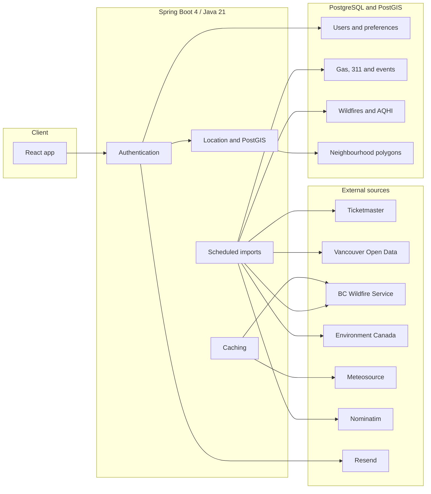

# Around Van

Spring Boot backend for [Vancouver Hub](https://vancouverhub.netlify.app).

Vancouver Hub offers a personalized dashboard for people in Vancouver using geolocation and spatial data. It brings together gas prices, 311 reports, local events, air quality, wildfires, fire weather, and current weather in one place.

The backend collects data from several public APIs, stores and organizes it in PostgreSQL, and uses a saved home location to return information relevant to each user.

Java 21. [API reference](API.md)


---

## What it does

Users create an account, confirm their email, and save a home location.

That location is reused across the dashboard to find nearby gas stations, events, 311 reports, weather conditions, AQHI readings, and wildfire information.

| Area | Details |
|------|---------|
| **Gas** | Finds nearby and cheaper stations and keeps daily price history for comparisons |
| **311** | Groups Vancouver service requests by category and importance, then filters them using user preferences |
| **Events** | Imports Ticketmaster events and provides upcoming, past, and nearby results |
| **Air quality** | Returns Environment Canada AQHI readings for the user's area |
| **Wildfires** | Imports active BC wildfires and provides nearby fire and fire weather information |
| **Weather** | Returns current conditions using the user's saved location |
| **Location** | Uses PostGIS to match coordinates to Vancouver neighbourhood polygons |
| **Accounts** | Registration, login, email confirmation, password reset, and JWT authentication |

---

## How it works

Most external data is collected before a user opens the dashboard.

Ticketmaster events, Vancouver 311 reports, active wildfires, and AQHI readings are imported on schedules and stored in PostgreSQL. Dashboard requests can then read from the database instead of waiting for several external services.

Weather and fire weather are fetched when needed and cached for about an hour.

Vancouver neighbourhood boundaries are stored as polygons in PostGIS. When a user saves their coordinates, PostgreSQL can determine which neighbourhood contains that point. The same location can then be shared across the different features.

Gas prices are stored per station and day instead of overwriting the previous value. This allows the backend to compare current prices with older city averages.

311 request types are mapped into categories such as road, water, garbage, safety, graffiti, and noise. Users can choose which categories they want to see, and important reports can be marked as seen.

---

## Architecture



---

## Engineering

Some of the main problems I worked through while building the backend were

- combining several unrelated APIs into one consistent system
- deciding which data should be stored, scheduled, or cached
- querying geographic polygons with PostGIS
- keeping historical gas prices without creating duplicate records
- filtering 311 reports differently for each user
- securing private routes with JWT authentication
- handling email confirmation and password recovery
- managing database changes with Flyway
- deploying the application with Docker

---

## Data sources

| Source | Used for | Update |
|--------|----------|--------|
| Ticketmaster Discovery API | Events | Every 15 minutes |
| BC Wildfire Service | Active wildfires | Every 15 minutes |
| Environment Canada | AQHI | Every 20 minutes |
| Vancouver Open Data | 311 reports | Every 6 hours |
| Gas collector | Gas stations and prices | When new data is posted |
| Meteosource | Current weather | Cached for about 1 hour |
| BC Wildfire Service | Fire weather | Cached for about 1 hour |
| Nominatim | Missing gas station coordinates | During gas imports |

Imports update existing records using stable identifiers instead of creating duplicates.

---

## Stack

| | |
|--|--|
| Language | Java 21 |
| Backend | Spring Boot 4.1 |
| Security | Spring Security, JWT RS256, BCrypt |
| Database | PostgreSQL, PostGIS, Spring Data JPA, Hibernate Spatial |
| Database migrations | Flyway |
| HTTP | Spring RestClient |
| Email | Resend |
| Deployment | Docker on Render |
| Frontend | React on Netlify |

---

## Code layout

```text
src/main/java/com/aroundvan/backend/
  api/             REST controllers
  auth/            Login, registration, JWT, email tokens
  user/            Profile, home location, preferences
  location/        Coordinates, distance, neighbourhoods
  gas/             Stations, prices, averages, trends
  servicerequest/  311 imports, filtering, seen reports
  events/          Ticketmaster events
  environment/     Wildfires, AQHI, weather
  mail/            Email
  config/          Security, CORS, scheduling

src/main/resources/db/migration/
  Flyway migrations
```

Full request and response examples are in [API.md](API.md).

---

[Berkay Sefayi](https://github.com/gitBerkayS)
